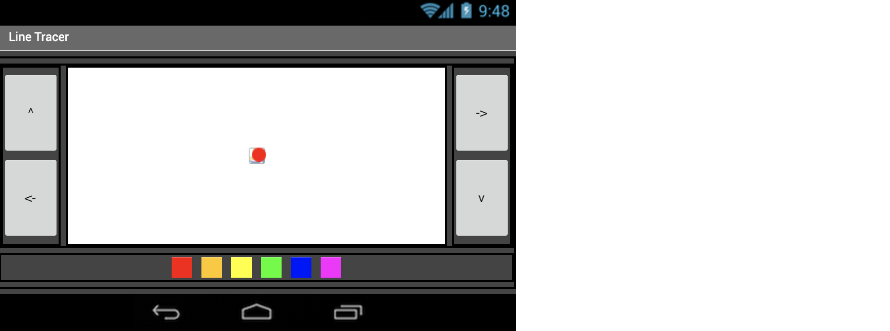
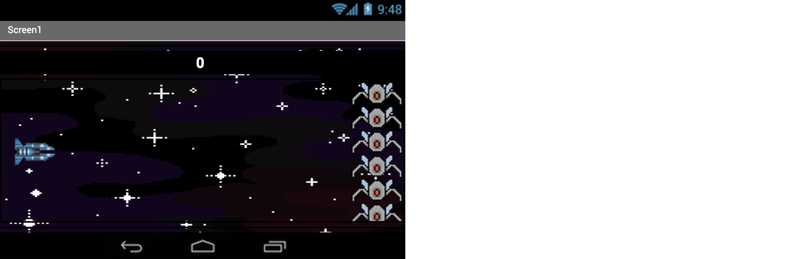
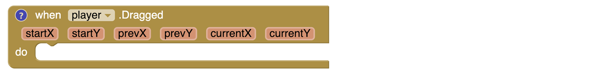
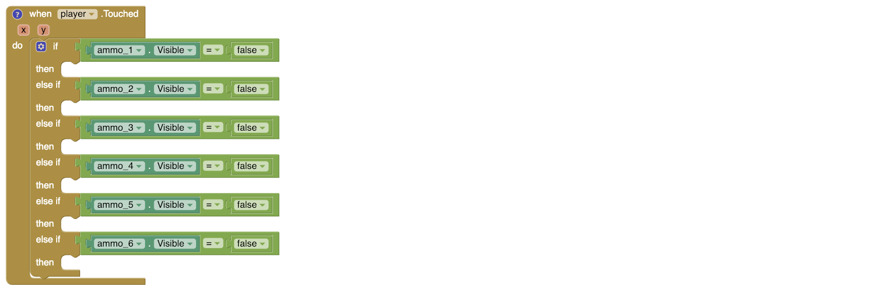
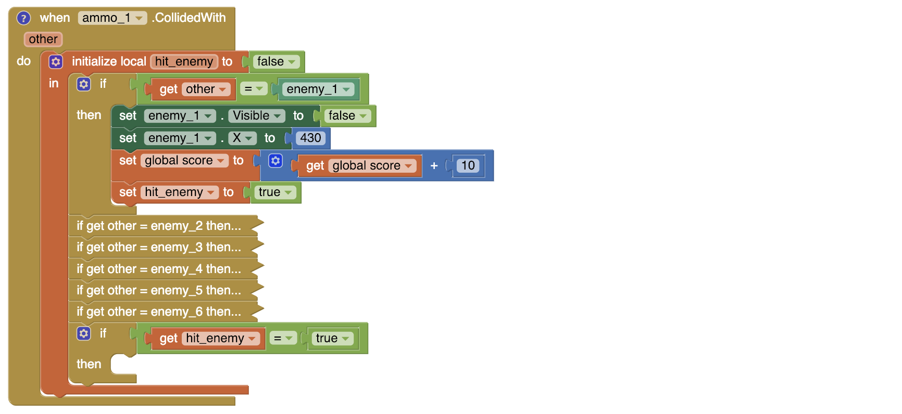

# SD2 Milestone Test 6

Welcome to SD2 Milestone Test 6 main page. You will be tested based on what you've learned in the previous meetings. 
Your subject for today's test is MIT App Inventor.

## Project

### Line Tracer

For your Project, please load LineTracer_template.aia on MIT App Inventor. Here, there is a pre-loaded template of a drawing app, with buttons and colors to pick, and empty code. Your task is to code the app for it to work.

* When the direction buttons are clicked, move the ball to the corresponding direction by 10 pixels
* When the color buttons are clicked, switch the ball's color to the selected color

#### **Download the file here**
https://tinyurl.com/newMilestoneSD2-6-1

## Debug

### Space Invaders

Upon abandoning Earth, mankind begin a conquest to find another planet to start anew colony. However, they must face an ongoing attack against aliens that blocks your way. Human's spaceship must not let alien spaceship pass our ship, by shooting laser toward them.

For your Debug test, please load SpaceInvaders.aia on MIT App Inventor. Here, there are missing parts of the code that must be fixed in order for the game to work.

#### **Download the file here**
https://tinyurl.com/newMilestoneSD2-6-2

#### At Screen1.Initialize

* Hide all enemies __(Hint: Set visibity)__
* Set the speed of enemy_time to "speed_enemy" __(Hint: Set time interval)__

#### When player.Dragged

* Make so that the player moves **vertically** when it is dragged

#### When player.Touched

* Ammo only fires when they are not visible
* When fired, ammo starts at player's position __(Hint: Set x and y)__
* To fire, make the ammo visible, and enable their timers __(Hint: ammo_1's timer is ammo_1_time, etc)__

#### When gameOver

* If the player is dead, create a MessageBox, with the message "Sorry, you lost!"
* If the player survive to the end, create a MessageBox, with the message "You win! Your score: " and then show the player score beside the message. __(Hint: use "join" in "Text" to join the message and the score)__
* All the MessageBox has a box with the text "Exit" and title "Game Over"

#### When ammo.CollidedWith other

* If the ammo collide with an enemy, make the ammo invisible, and reset the **x position to 0**

**DO NOT DELETE OR EDIT COLLAPSED BLOCKS, DOING SO WILL CAUSE THE GAME TO NOT WORK**

## GOOD LUCK
